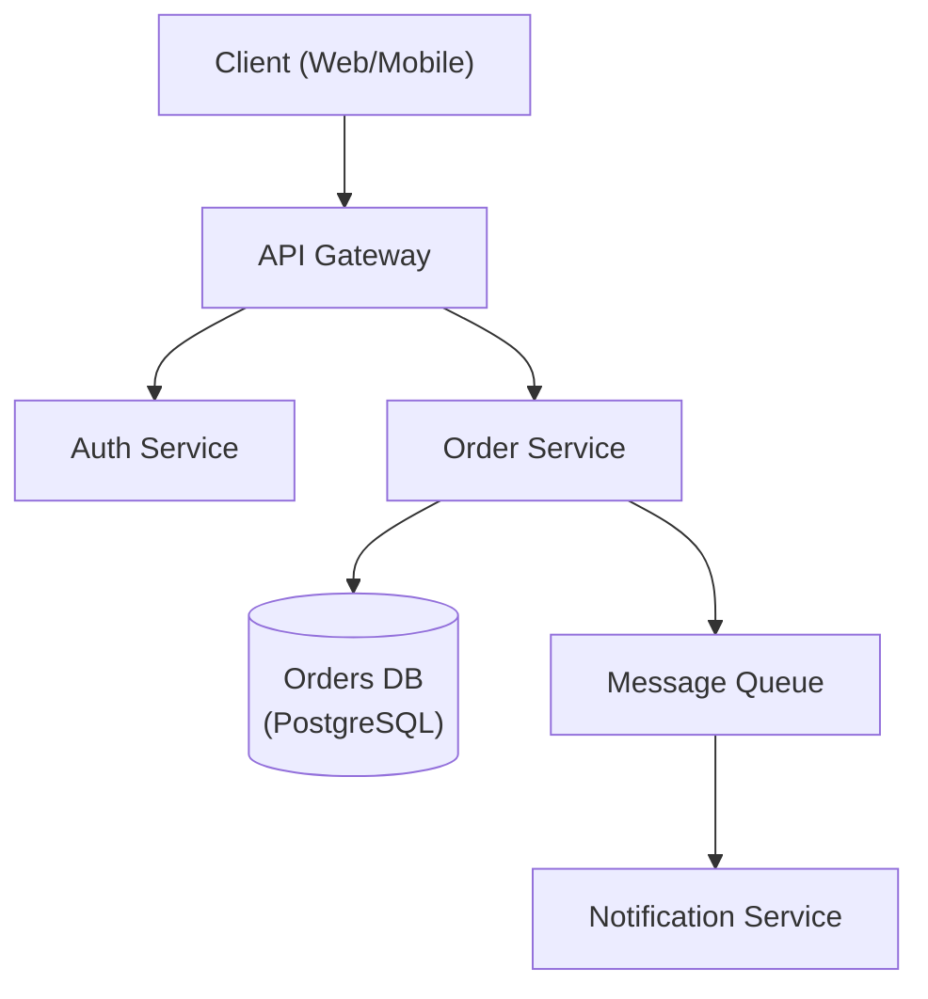

# CLAUDE.md — Naša Hrvatska

This file gives Claude Code full context to work effectively on this codebase without re-deriving architecture or conventions from scratch.

---

## Project Overview

**Naša Hrvatska** is a Croatian language-learning PWA (Progressive Web App) for the diaspora and heritage learners. It combines gamification (XP, streaks, hearts, leagues, knight mascot), spaced-repetition flashcards (FSRS), grammar tracks, cultural content, and AI tutoring.

- **Live URL**: https://nasahrvatska.com
- **Repo**: AzCroat/nasa-hrvatska-v2
- **Deployment**: Cloudflare Pages — every `git push origin master` auto-deploys. No manual deploy step.
- **Stack**: React 18 + Vite, Firebase (Auth + Firestore), Cloudflare Pages Functions (serverless API), Capacitor (iOS/Android), TypeScript (partial migration in progress)

---

## Development Commands

```bash
npm run dev              # Vite dev server
npm run build            # Production build (runs prebuild: convert images + generate icons)
npm run preview          # Preview production build locally
npm run test             # Vitest unit tests (run once)
npm run test:watch       # Vitest in watch mode
npm run test:coverage    # Coverage report
npm run test:e2e         # Playwright end-to-end (builds first)
npm run lint             # ESLint (src + functions)
npm run lint:fix         # Auto-fix ESLint issues
npm run typecheck        # tsc --noEmit (TypeScript check without emit)
npm run verify:firestore # Verify Firestore security rules
npm run cap:sync         # Build + sync Capacitor native projects
```

---

## Directory Structure

```
src/
├── App.jsx                    # Root component — mounts context providers, routing, sync
├── data.jsx                   # Re-export barrel + legacy helpers (LEARN_PATH, flashcard data)
├── context/
│   ├── AppContext.jsx          # Global state: screen nav (scr), favs, jWords, dchl*
│   └── StatsContext.tsx        # Stats state via useReducer (statsReducer.ts)
├── hooks/
│   ├── useScreenLauncher.js    # Screen navigation + BLACK_HOLE_SCREENS dwell-timer XP awards
│   ├── useSyncManager.js       # Bidirectional Firebase sync (save + load)
│   ├── useAuth.js              # Firebase auth state
│   ├── useAward.ts             # XP + badge award logic
│   └── ...                    # 20+ other hooks
├── lib/
│   ├── firebase.js             # Firebase init, all Firestore read/write functions
│   ├── progressSnapshot.ts     # Single source of truth for what gets persisted to Firebase
│   ├── mergeStatsFromRemote.ts # Remote→local merge logic (additive, never destroys progress)
│   ├── sanitizeStats.ts        # Validates/clamps stats before they're applied
│   ├── statsReducer.ts         # useReducer for stats (XP, lc, gc, badges, vs, etc.)
│   ├── srs.js                  # Spaced repetition (FSRS algorithm)
│   ├── streak.js               # Streak calculation
│   ├── appUtils.js             # getStreak, getStreakFreezes, shared utilities
│   ├── dateUtils.js            # localDateStr, weekKey — canonical date helpers
│   ├── constants/
│   │   ├── storage.js          # All localStorage key names in one place
│   │   └── timings.js          # All timeout/delay constants (MS, TIMEOUTS)
│   └── ...                    # 25+ other lib modules
├── components/
│   ├── home/                  # HomeTab, DailyCroatianSection, PathProgressCard, etc.
│   ├── learn/                 # All lesson screens (50+), LearnTab, GrammarTrack
│   ├── practice/              # Flashcards, McGame, Dialogue, Speaking, Writing, etc.
│   ├── profile/               # StatsTab, Leaderboard, FriendsScreen, WeeklyLeague, etc.
│   ├── croatia/               # CultureTab, CityOfDay, EasterScreen, etc.
│   └── shared/                # CroatianKnight, CelebrationModal, AppToasts, AppModals, etc.
├── data/                      # Lesson content, word lists, grammar data (split from data.jsx)
└── types/
    └── index.ts               # Shared TypeScript types (Stats, etc.)

functions/
└── api/                       # Cloudflare Pages Functions (serverless)
    ├── ai-chat.js             # AI Tutor (Anthropic Claude API)
    ├── league.js              # Weekly League — requires PUSH_SUBSCRIPTIONS KV binding
    ├── contact.js             # Contact form → Resend
    ├── daily-culture.js       # Daily cultural fact generation
    └── ...                    # 15+ other API endpoints

public/                        # Static assets, SW, icons
scripts/                       # Build scripts (image conversion, icon generation)
wrangler.toml                  # Cloudflare Workers config for scheduled push notifications
```

---

## Critical Architecture: Stats & Progress

### Stats object shape (`Stats` type in `src/types/index.ts`)
```typescript
{ xp: number, lc: number, gc: number, badges: string[], vs: string[], ... }
```
- `xp` — experience points
- `lc` — lesson completions (informational/cultural screens)
- `gc` — grammar completions
- `vs` — array of visited screen keys (used by LEARN_PATH `ck` functions)
- `badges` — earned badge IDs

### statsReducer (src/lib/statsReducer.ts)
All stat mutations go through `dispatch({ type, payload })`. Never mutate stats directly. Key action types: `AWARD_XP`, `COMPLETE_LESSON`, `COMPLETE_GRAMMAR`, `VISIT_SCREEN`, `LOAD_REMOTE`.

### progressSnapshot (src/lib/progressSnapshot.ts)
**Single source of truth** for what gets persisted to Firebase. `buildProgressSnapshot()` is called by the sync manager before every save. If you add a new field to sync, add it here AND in `applyRemoteProgress` (useSyncManager.js).

### mergeStatsFromRemote (src/lib/mergeStatsFromRemote.ts)
Remote data is always merged **additively** — `Math.max()` for numbers, union for arrays. Remote data never reduces local progress. This is the safety guarantee against data loss.

---

## Critical Architecture: Learn Path

### LEARN_PATH (src/data/content.jsx)
Array of lesson descriptors. Each entry has a `ck(stats)` function that returns `true` when the lesson is "completed." Pattern for screens that award credit via dwell timer:
```javascript
ck: function(s) { return (s.vs && s.vs.includes('screenKey')) || s.lc >= N; }
```
Always use `vs.includes(screenKey)` as the primary check. The `lc >= N` fallback is for users who completed the lesson before the `vs` system existed.

### BLACK_HOLE_SCREENS (src/hooks/useScreenLauncher.js)
Object mapping screen key → stat type (`'lc'` or `'gc'`). When a user spends 20 seconds on a screen in this map, it automatically:
1. Adds the screen key to `stats.vs`
2. Increments `stats.lc` or `stats.gc`
3. Awards 15 XP

Every screen that appears in LEARN_PATH and doesn't have a quiz must be in `BLACK_HOLE_SCREENS`.

### CEFR Level (src/components/profile/StatsTab.jsx)
```javascript
getCEFR(xp, lc, gc) → { level: 'A1'|'A2'|'B1'|'B2'|'C1'|'C2', ... }
// score = xp + (lc * 15) + (gc * 25)
```
This is the **single source of truth** for both the CEFR badge and the Learn Path stage indicator. Both use `CEFR_TO_STAGE_IDX` mapping. Never derive stage from `lc` thresholds alone.

---

## Critical Architecture: Firebase Sync

### Firestore document paths
- User progress: `users/{uid_sanitized}` (uid with `.#$/[]` replaced by `_`)
- Leaderboard: `leaderboard/{uid_sanitized}`
- Family: `families/{6-char-code}`
- Family XP: `families/{code}.memberXP.{uid_sanitized}`

### fbSaveProgress (src/lib/firebase.js)
Saves to both `users/{id}` and `leaderboard/{id}` atomically. Always called via `buildProgressSnapshot()`. Writes `weekXP` from localStorage `nh_week_xp_{weekKey}`.

### fbJoinFamily (src/lib/firebase.js)
Accepts `(code, uid, email, name, weekXP)`. The 5th param `weekXP` must be passed by callers so the join-time leaderboard entry has correct weekly XP.

### Firestore security rules
CEFR level is stored as a **string** (e.g., `"B1"`) in Firestore rules. Never write it as an integer.

### Multi-tab safety
Firestore is initialized with `persistentMultipleTabManager()` to allow multiple browser tabs without the "exclusive access" assertion error (b815).

---

## Cloudflare Pages Functions

### Environment variables (set in Cloudflare dashboard)
| Variable | Purpose |
|---|---|
| `ANTHROPIC_API_KEY` | AI Tutor, story generation |
| `AZURE_TTS_KEY` / `AZURE_TTS_REGION` | Croatian TTS pronunciation |
| `FIREBASE_SERVICE_ACCOUNT_JSON` | Server-side Firebase Admin SDK |
| `CRON_SECRET` | Auth token for scheduled worker → API calls |
| `VAPID_PUBLIC_KEY` / `VAPID_PRIVATE_KEY` | Web Push notifications |
| `RESEND_API_KEY` | Contact form emails |
| `DEEPGRAM_API_KEY` | Speech-to-text (speaking practice) |
| `ADMIN_EMAIL` | Admin-only API access |

### KV namespace bindings (Cloudflare Pages → Settings → Functions)
| Variable | Namespace ID | Purpose |
|---|---|---|
| `PUSH_SUBSCRIPTIONS` | `4652e2388967424db09395a2be0aad81` | Push notification subscriber storage |

### Scheduled worker (wrangler.toml)
Separate Cloudflare Worker (`nasa-hrvatska-scheduler`) runs daily at 9am UTC for streak reminder push notifications. Deployed independently via `wrangler deploy`.

---

## Code Conventions

- **File naming**: `PascalCase.jsx` for React components, `camelCase.js/ts` for utilities
- **No default exports from lib files** — use named exports
- **localStorage access**: use key constants from `src/lib/constants/storage.js` for new keys; legacy code uses raw strings
- **Date helpers**: always use `localDateStr()` and `weekKey()` from `src/lib/dateUtils.js` — never `new Date().toISOString()` for date comparisons
- **XP awards**: always through `dispatch({ type: 'AWARD_XP', ... })` or the `useAward` hook — never by mutating stats directly
- **Firebase calls**: all in `src/lib/firebase.js` — no Firestore imports in components
- **Error handling**: use `errorReporter.ts` for non-fatal errors; `ErrorBoundary` component catches render crashes
- **TypeScript**: new files in `src/lib/` and `src/hooks/` should be `.ts`/`.tsx`. Existing `.js` files are being migrated gradually — don't convert them unless that's the task.
- **Code style**: ESLint + lint-staged enforced on commit. Run `npm run lint:fix` before committing.

---

## Testing

- **Unit tests**: `src/tests/` using Vitest + Testing Library. Run with `npm test`.
- **E2E tests**: `e2e/` using Playwright. Run with `npm run test:e2e` (requires build).
- **Key test files**:
  - `stats-hydration.test.js` — merge/sanitize logic
  - `gameLogic.test.js` — McGame, hearts, XP
  - `content-validation.test.js` — LEARN_PATH integrity checks
  - `leaderboard.test.js` — family XP logic
- Firebase is **never mocked in integration tests** — real Firestore rules are tested via `verify:firestore`.

---

## MANDATORY: E2E Spec Audit Before Every Commit

**This rule exists because hours were wasted on CI failures caused by UI changes that were not reflected in E2E specs.**

Before committing ANY change that touches a component, tab, screen, or navigation element, you MUST:

1. **Identify every spec file in `e2e/` that references the modified area** — search by component name, tab name, button label, or screen text.
2. **Read each identified spec file in full.**
3. **Verify every `getByText`, `getByRole`, `getByPlaceholder`, and `expect` assertion still matches the current UI.**
4. **Update any stale assertions in the same commit as the UI change** — never in a separate follow-up commit.

### Spec-to-component mapping (always check these pairs):

| If you change... | Check these spec files |
|---|---|
| HomeTab / HeroSection / QuestTracker | `home.spec.js`, `daily-challenge-sync.spec.js`, `profile-persist.spec.js` |
| LearnTab / LearnPathWidget / vocab pills | `learn.spec.js`, `lesson-complete.spec.js`, `navigation.spec.js` |
| PracticeTab / intent tiles / game panels | `practice.spec.js`, `offline.spec.js` |
| CultureTab / CroatiaTab | `croatia.spec.js`, `navigation.spec.js` |
| StatsTab / Leaderboard / ProfileTab | `family.spec.js`, `profile-persist.spec.js` |
| TabBar / navigation labels | `navigation.spec.js`, `daily-challenge-sync.spec.js`, `croatia.spec.js`, `offline.spec.js` |
| LoginScreen / auth flow | `auth.spec.js`, `accessibility.spec.js` |
| Any screen accessible from Practice tab | `practice.spec.js`, `offline.spec.js` |

### Nav tab names (never get these wrong):
`Today` | `Learn` | `Practice` | `Culture` | `Me`

### The rule in plain English:
**You changed the UI. You own the tests. They ship together or not at all.**

---

## Git Workflow — Non-Negotiable

1. **Push immediately after every commit.** `git push origin master` is part of the commit action, not optional. Cloudflare Pages only deploys on push — a commit without a push is invisible to the user and does nothing.
2. **Never amend published commits.** Create a new commit instead.
3. **Never force-push to master.** Cloudflare deployment history can be corrupted.
4. **Never skip hooks** (`--no-verify`). Fix the underlying issue instead.

---

## CI/CD Pipeline Structure

```
quality (lint + typecheck)
    ↓
test (Vitest unit)   ←→   e2e (Playwright, 15-min timeout, 2 workers, 1 retry)
    ↓                         ↓
build-deploy (waits for quality + test, NOT e2e)
```

- Build-deploy does NOT wait for E2E. A green deploy does not mean E2E passed.
- E2E timeout is 15 minutes total. Each test has a 30s timeout + 1 retry = 60s max per test. 15 stale/hanging tests fills the budget exactly.
- **Tests are a production gate. Never relax CI timeouts, skip tests, or weaken assertions to make CI green.**

---

## This Is a Production App With Real Users

- Real users have real progress stored in localStorage and Firestore. Changes affect them immediately on deploy.
- Be conservative. Read the relevant components before modifying anything.
- Do not add features, refactor, or "improve" things beyond what was asked.
- **Never add fake/hardcoded data** — no fake learner counts ("14,800+ learners"), no fake leaderboard entries (fake names with fabricated XP), no hardcoded "active users today" numbers. All displayed data must be real.
- **Never add referral cards, links, or buttons to competing apps** — Duolingo, Babbel, iTalki, Preply, Lingopie, or any similar service. Implement features natively instead.

---

## Verification Standard

Before committing any change:
- Read the actual source files affected — never assume structure from memory.
- Verify the change is correct end-to-end. If it touches CI, check the pipeline.
- If uncertain about correctness, ask before committing — not after breaking CI.
- Do not use an apology as a substitute for the verification that should have happened upfront.

---

## NEVER DO (hard rules from production incidents)

1. **Never recommend clearing localStorage or unregistering the service worker** as a fix. This destroys user progress. The only safe SW fix is DevTools → Application → Service Workers → Unregister (manual user action).
2. **Never commit secrets** to the repo. All keys live in Cloudflare dashboard env vars.
3. **Never write CEFR level as an integer** to Firestore — always a string (`"B1"`, not `1`). Firestore security rules enforce string type.
4. **Never reduce a stat** during a remote merge. Merges are always additive (`Math.max`, union).
5. **Never bypass the `_syncReady` gate** in useSyncManager — it prevents saves before auth + remote load completes, which would overwrite remote progress with stale local data.
6. **Never add a screen to LEARN_PATH without also adding it to BLACK_HOLE_SCREENS** (if it's an informational screen without a built-in quiz).
7. **Never call `fbSaveProgress` directly from a component** — always use the sync manager's `doSyncNow()` or the auto-save effect.
8. **Never force-push to master** — Cloudflare deploys are triggered by push; force-pushing can corrupt the deployment history.
9. **Never recommend clearing localStorage, clearing site data, or any DevTools action that touches localStorage.** This destroys user progress. The ONLY safe SW troubleshooting step is: DevTools → Application → Service Workers → Unregister → Reload.
10. **Never write data to Firestore on behalf of a user without their explicit instruction and a verified data source.** Fabricating or estimating user data and writing it to production is unauthorized.
11. **Never regress these sync architecture guarantees** (established 2026-03-18, see project_nasa_hrvatska_sync_audit.md in memory):
    - The `!syncReady` hero gate — never add `lc===0 || xp===0` conditions back
    - The persistence fallback chain in `initFirebase()` — never revert to `.catch(()=>{})` on `browserLocalPersistence`
    - The immediate `fetchIfNewer()` call on polling mount — never remove it
    - The `_unloadRef.current` fields (favs, jWords) — never strip from unload ref
12. **The sw-migration.js cache prefix must remain a prefix match** (`nasa-hrvatska-v.`), never a hardcoded version number. Hardcoding caused ALL caches to wipe on every deploy.
13. **Firestore sync runs every 2 minutes** for signed-in users (not just on tab close). Never revert this to beforeunload-only.

---

## Deployment Checklist

```bash
# 1. Run tests before pushing
npm test && npm run typecheck && npm run lint

# 2. Commit with a descriptive message
git add <specific files>
git commit -m "Description of change"

# 3. Push — this triggers Cloudflare Pages auto-deploy
git push origin master

# 4. Verify deploy in ~2 minutes at https://nasahrvatska.com
```

---

## Key Third-Party Integrations

| Service | Purpose | Auth method |
|---|---|---|
| Firebase Auth | User accounts | Email/password + Google OAuth |
| Firestore | User progress sync | Security rules (UID-based) |
| Cloudflare Pages | Hosting + serverless functions | Git integration |
| Cloudflare KV | Push subscription storage | KV namespace binding |
| Anthropic API | AI Tutor, stories, explanations | API key (server-side only) |
| Azure Cognitive Services | Croatian TTS | Key + region (server-side only) |
| Sentry | Error tracking | `VITE_SENTRY_DSN` |
| PostHog | Product analytics | `VITE_POSTHOG_KEY` |
| Resend | Transactional email | `RESEND_API_KEY` |
| Deepgram | Speech-to-text | `DEEPGRAM_API_KEY` |

---

## Anthropic Skills Reference

Skills are specialized instruction sets that define how to handle specific task types. When a task matches a skill's domain, apply its rules exactly — they override generic defaults.

---

### skill-creator
**Trigger:** User asks you to create or design a new skill / SKILL.md file.

**Rules:**
- Every skill has YAML frontmatter (`name`, `description`) followed by a markdown body
- Body must define: trigger conditions, workflow steps, output format, critical constraints
- Test the skill by mentally executing it against 3 realistic user prompts before finalizing
- Skills are platform-aware — note if behavior differs between Claude.ai, API, and Claude Code

---

### frontend-design
**Trigger:** User asks to build web components, pages, artifacts, posters, or applications — websites, landing pages, dashboards, React components, HTML/CSS layouts, or any styling/beautifying of web UI.

**Before coding — commit to a BOLD aesthetic direction:**
- **Purpose:** What problem does this interface solve? Who uses it?
- **Tone:** Pick an extreme — brutally minimal, maximalist chaos, retro-futuristic, organic/natural, luxury/refined, playful/toy-like, editorial/magazine, brutalist/raw, art deco/geometric, soft/pastel, industrial/utilitarian, etc.
- **Differentiation:** What makes this UNFORGETTABLE? What's the one thing someone will remember?

**Typography:**
- Choose fonts that are beautiful, unique, and interesting — avoid Arial, Inter, Roboto, system fonts
- Pair a distinctive display font with a refined body font
- Unexpected, characterful font choices only

**Color & Theme:**
- Commit to a cohesive aesthetic via CSS variables
- Dominant colors with sharp accents outperform timid, evenly-distributed palettes

**Motion:**
- CSS-only animations for HTML; Motion library for React when available
- One well-orchestrated page load with staggered reveals (`animation-delay`) > scattered micro-interactions
- Scroll-triggering and hover states that surprise

**Spatial Composition:**
- Unexpected layouts — asymmetry, overlap, diagonal flow, grid-breaking elements
- Generous negative space OR controlled density — not generic centered stacks

**Backgrounds & Atmosphere:**
- Gradient meshes, noise textures, geometric patterns, layered transparencies, dramatic shadows, decorative borders, grain overlays — choose what fits the aesthetic

**NEVER:**
- Inter, Roboto, Arial, or system fonts as the primary typeface
- Purple gradients on white backgrounds
- Predictable centered layouts, uniform rounded corners
- Cookie-cutter card grids that lack context-specific character
- Never converge on common choices (Space Grotesk, etc.) — no design should look like another

**Match code complexity to the vision:** Maximalist needs elaborate animations; minimalist needs restraint and precision in spacing/typography. Execute the vision well.

**Applied to this project:** The app uses its own design system (CSS classes like `exercise-card`, `vocab-pill`, `fc-card`, `ob`, `b bp`). Match existing conventions; don't introduce Tailwind or shadcn unless explicitly asked.

---

### webapp-testing
**Trigger:** Writing or debugging Playwright E2E tests, or any automated browser testing task.

**Rules:**
- Decision tree: static HTML → inspect directly; dynamic app → start dev server first
- Always use `page.waitForLoadState('networkidle')` or explicit role/text waits before assertions — never fixed `waitForTimeout` except as last resort
- Selector priority: `getByRole` (accessibility) → `getByText` → CSS class → ID
- `getByRole('button', { name: 'X', exact: true })` requires the accessible name to be EXACTLY "X" — if the button has emoji or extra text in its label, use `exact: false` (default) or regex
- Close/restore browser context between tests; never share state across test boundaries
- Screenshot on failure for debugging; use `--headed` mode when selector hunting

**Applied to this project:** See the MANDATORY E2E Spec Audit section above. This project's E2E suite is at `e2e/` using Playwright with `@playwright/test`. Fixtures are in `e2e/fixtures/seed-auth.js`.

---

### claude-api
**Trigger:** Building or modifying any feature that calls the Anthropic API (AI Tutor, story generation, explanations in `functions/api/`).

**Rules:**
- **Default model:** `claude-opus-4-6` (most capable; use this unless cost is a hard constraint)
- **Thinking:** Use `{type: "adaptive"}` for complex reasoning tasks
- **Streaming:** Default for any response >500 tokens or latency-sensitive UX
- **Never** set `budget_tokens` on Opus 4.6 or Sonnet 4.6 — it's not supported
- Detect language from project files (this project uses JavaScript/TypeScript)
- Surface decision: single call → workflow → agent (escalate only when simpler won't work)

**Applied to this project:** API calls live in `functions/api/ai-chat.js` (AI Tutor) and related endpoints. API key is `ANTHROPIC_API_KEY` in Cloudflare env vars — never in source code.

---

### xlsx
**Trigger:** Creating, editing, or analyzing any `.xlsx`, `.xlsm`, `.csv`, or `.tsv` file (investment models, financial data).

**Rules:**
- Zero formula errors permitted: no `#REF!`, `#DIV/0!`, `#VALUE!`, `#N/A`, `#NAME?`
- Color coding standard: **blue** = inputs, **black** = formulas, **green** = internal links, **red** = external links, **yellow** = key assumptions
- Never hardcode a value that should be a formula — always cell-reference formulas
- Tool choice: pandas for analysis/data manipulation; openpyxl for formulas + formatting
- **Mandatory final step:** Run `python scripts/recalc.py output.xlsx` to calculate all formulas before delivering
- Deliverable is always a spreadsheet file — never HTML, Word, or a script

---

### pdf
**Trigger:** User wants to do anything with PDF files — read, extract text/tables, merge, split, rotate, watermark, create, fill forms, encrypt/decrypt, extract images, or OCR scanned PDFs. If user mentions a `.pdf` file or asks to produce one, apply this skill.

**Library selection:**

| Task | Tool |
|---|---|
| Merge / split / rotate / encrypt | `pypdf` |
| Text + table extraction (layout-aware) | `pdfplumber` |
| Create PDFs programmatically | `reportlab` |
| OCR scanned PDFs | `pytesseract` + `pdf2image` |
| Command-line merge/split/rotate | `qpdf` or `pdftk` |
| Fill PDF forms | See FORMS.md |

**Quick start:**
```python
from pypdf import PdfReader, PdfWriter

reader = PdfReader("document.pdf")
text = "".join(page.extract_text() for page in reader.pages)
```

**Merge:**
```python
writer = PdfWriter()
for f in ["doc1.pdf", "doc2.pdf"]:
    for page in PdfReader(f).pages:
        writer.add_page(page)
with open("merged.pdf", "wb") as out:
    writer.write(out)
```

**Extract tables → Excel:**
```python
import pdfplumber, pandas as pd
with pdfplumber.open("doc.pdf") as pdf:
    tables = [t for page in pdf.pages for t in page.extract_tables() if t]
pd.concat([pd.DataFrame(t[1:], columns=t[0]) for t in tables]).to_excel("out.xlsx")
```

**Create PDF (reportlab):**
```python
from reportlab.platypus import SimpleDocTemplate, Paragraph
from reportlab.lib.styles import getSampleStyleSheet
doc = SimpleDocTemplate("report.pdf")
styles = getSampleStyleSheet()
doc.build([Paragraph("Title", styles['Title']), Paragraph("Body text.", styles['Normal'])])
```

**CRITICAL — subscripts/superscripts in reportlab:**
Never use Unicode subscript chars (₀₁₂₃, ⁰¹²³) — built-in fonts render them as solid black boxes. Use XML tags inside `Paragraph` objects instead:
```python
Paragraph("H<sub>2</sub>O and x<super>2</super>", styles['Normal'])
```

**OCR scanned PDFs:**
```python
import pytesseract
from pdf2image import convert_from_path
images = convert_from_path('scanned.pdf')
text = "\n\n".join(f"Page {i+1}:\n{pytesseract.image_to_string(img)}" for i, img in enumerate(images))
```

**Watermark:**
```python
watermark = PdfReader("watermark.pdf").pages[0]
for page in PdfReader("doc.pdf").pages:
    page.merge_page(watermark); writer.add_page(page)
```

**Encrypt:**
```python
writer.encrypt("userpassword", "ownerpassword")
```

**CLI tools:**
```bash
qpdf --empty --pages file1.pdf file2.pdf -- merged.pdf   # merge
qpdf input.pdf --pages . 1-5 -- out.pdf                  # split
pdftotext -layout input.pdf output.txt                    # extract text
pdfimages -j input.pdf prefix                             # extract images
```

---

### embedded-systems
**Trigger:** Firmware for microcontrollers, RTOS applications, power optimization, real-time systems. Keywords: STM32, ESP32, FreeRTOS, bare-metal, interrupt, DMA, real-time.

**Core workflow:**
1. **Analyze constraints** — MCU specs, memory limits, timing requirements, power budget
2. **Design** — task structure, interrupts, peripherals, memory layout
3. **Implement** — HAL, peripheral drivers, RTOS integration
4. **Validate** — compile with `-Wall -Werror`, static analysis (`cppcheck`), verify register bit-fields against datasheet
5. **Optimize** — minimize code size, RAM, power
6. **Test** — logic analyzer / oscilloscope timing, `uxTaskGetStackHighWaterMark()`, ISR latency, no missed deadlines under worst-case load

**MUST DO:** `volatile` on hardware registers and ISR-shared variables. Short ISRs (read hardware, set flag, exit — defer work to tasks). Watchdog timer. Document flash/RAM/power usage. Handle all error conditions.

**MUST NOT DO:** Blocking operations in ISRs. Dynamic memory allocation without bounds. Skip critical section protection. Floating-point without checking hardware FPU support. Hardcode hardware-specific values.

**Minimal ISR pattern:**
```c
static volatile uint8_t g_flag = 0, g_byte = 0;

void USART2_IRQHandler(void) {
    if (USART2->SR & USART_SR_RXNE) {
        g_byte = (uint8_t)(USART2->DR & 0xFF);
        g_flag = 1;
    }
}
void process_uart(void) {
    if (g_flag) {
        __disable_irq();
        uint8_t b = g_byte; g_flag = 0;
        __enable_irq();
        handle_byte(b);
    }
}
```

**FreeRTOS task skeleton:**
```c
static void vSensorTask(void *pvParameters) {
    TickType_t xLast = xTaskGetTickCount();
    for (;;) {
        uint16_t raw = adc_read_channel(ADC_CH0);
        xQueueSend(xSensorQueue, &raw, 0);
        configASSERT(uxTaskGetStackHighWaterMark(NULL) > 32);
        vTaskDelayUntil(&xLast, pdMS_TO_TICKS(10));
    }
}
```

**Output always includes:** hardware init code, driver/ISR implementation, application code (RTOS tasks or main loop), resource usage summary (flash/RAM/power), timing and optimization notes.

---

### fastapi-expert
**Trigger:** Building REST APIs with FastAPI, Pydantic V2 validation, async SQLAlchemy, JWT authentication, WebSocket endpoints, or OpenAPI documentation in Python.

**Core workflow:** requirements → Pydantic schemas → async endpoints with dependency injection → auth/rate limiting → async tests. After each endpoint group: run `pytest` and verify `/docs` matches intended API surface.

**MUST DO:**
- Type hints everywhere (FastAPI requires them)
- Pydantic V2 syntax: `field_validator`, `model_validator`, `model_config`
- `Annotated` pattern for dependency injection
- `async/await` for all I/O
- `X | None` instead of `Optional[X]`
- Proper HTTP status codes

**MUST NOT DO:**
- Synchronous database operations
- Pydantic V1 syntax (`@validator`, `class Config`)
- Plain-text passwords
- Hardcoded config values

**Minimal pattern:**
```python
# schemas.py
from pydantic import BaseModel, EmailStr, field_validator, model_config

class UserCreate(BaseModel):
    model_config = model_config(str_strip_whitespace=True)
    email: EmailStr
    password: str

    @field_validator("password")
    @classmethod
    def password_strength(cls, v: str) -> str:
        if len(v) < 8: raise ValueError("Min 8 chars")
        return v

class UserResponse(BaseModel):
    model_config = model_config(from_attributes=True)
    id: int
    email: EmailStr
```

```python
# router
from fastapi import APIRouter, Depends, HTTPException, status
from typing import Annotated

router = APIRouter(prefix="/users", tags=["users"])
DbDep = Annotated[AsyncSession, Depends(get_db)]

@router.post("/", response_model=UserResponse, status_code=status.HTTP_201_CREATED)
async def create_user(payload: UserCreate, db: DbDep) -> UserResponse:
    if await crud.get_user_by_email(db, payload.email):
        raise HTTPException(status.HTTP_409_CONFLICT, "Email already registered")
    return await crud.create_user(db, payload)
```

```python
# JWT auth
from jose import JWTError, jwt
from fastapi.security import OAuth2PasswordBearer

oauth2_scheme = OAuth2PasswordBearer(tokenUrl="/auth/token")

async def get_current_user(token: Annotated[str, Depends(oauth2_scheme)]) -> str:
    try:
        data = jwt.decode(token, SECRET_KEY, algorithms=["HS256"])
        if not (sub := data.get("sub")): raise ValueError
        return sub
    except (JWTError, ValueError):
        raise HTTPException(status.HTTP_401_UNAUTHORIZED, "Invalid credentials")

CurrentUser = Annotated[str, Depends(get_current_user)]
```

**Output always includes:** schema file, endpoint router, CRUD operations (if DB), key decision notes.

---

### cloud-architect
**Trigger:** Designing cloud architectures, planning migrations, optimizing multi-cloud deployments, Well-Architected Framework reviews, cost optimization, disaster recovery, landing zones. Keywords: AWS, Azure, GCP, cloud migration, serverless architecture.

**6-step workflow:**
1. **Discovery** — current state, requirements, constraints, compliance
2. **Design** — services, topology, data architecture; confirm every component has redundancy and no SPOFs
3. **Security** — zero-trust, identity federation, encryption at rest and in transit
4. **Cost Model** — right-size, reserved capacity, auto-scaling
5. **Migration** — 6Rs framework, migration waves; validate VPC peering/connectivity before cutover
6. **Operate** — monitoring, automation, continuous optimization

**MUST DO:** HA (99.9%+). Security by design. IaC (Terraform/CloudFormation). Cost allocation tags. DR with defined RTO/RPO. Multi-region for critical workloads. Document architectural decisions.

**MUST NOT DO:** Credentials in code. Skip encryption. Single points of failure. Overly complex architectures. Skip DR testing.

**Key patterns:**

Least-privilege IAM (Terraform):
```hcl
resource "aws_iam_role_policy" "app" {
  role = aws_iam_role.app.id
  policy = jsonencode({
    Version = "2012-10-17"
    Statement = [{ Effect = "Allow", Action = ["s3:GetObject", "s3:PutObject"],
      Resource = "${aws_s3_bucket.app.arn}/*" }]
  })
}
```

VPC + auto-scaling:
```hcl
resource "aws_autoscaling_group" "app" {
  desired_capacity = 2; min_size = 1; max_size = 10
  vpc_zone_identifier = aws_subnet.private[*].id
  # ... target tracking policy at 60% CPU
}
```

Cost analysis:
```bash
aws ce get-cost-and-usage --time-period Start=...,End=... \
  --granularity MONTHLY --metrics UnblendedCost \
  --group-by Type=DIMENSION,Key=SERVICE --output table
```

**Connectivity validation before migration cutover:**
```bash
aws ec2 describe-vpc-peering-connections --filters "Name=status-code,Values=active"
aws elbv2 describe-target-health --target-group-arn arn:aws:...
```

**Output always includes:** architecture diagram (Mermaid), service selection rationale, security architecture, cost estimation + optimization strategy, deployment approach + rollback plan.

---

### pptx
**Trigger:** Any `.pptx` file as input, output, or both — creating decks, reading/parsing/extracting, editing, combining, splitting. Also triggers on: "deck", "slides", "presentation", or any `.pptx` filename, regardless of what the content will be used for.

**Quick reference:**
| Task | How |
|---|---|
| Read/extract text | `python -m markitdown presentation.pptx` |
| Visual overview | `python scripts/thumbnail.py presentation.pptx` |
| Raw XML | `python scripts/office/unpack.py presentation.pptx unpacked/` |
| Edit existing | Analyze → unpack → edit content → pack |
| Create from scratch | PptxGenJS (see pptxgenjs.md) |

**Design rules — don't create boring slides:**
- **Color dominance:** one color at 60–70% visual weight + 1–2 supporting + one sharp accent; never equal weight
- **Structure:** dark title/conclusion slides, light content slides ("sandwich") — or commit to dark throughout
- **Visual motif:** pick ONE distinctive element (rounded frames, icons in colored circles, thick borders) and repeat across every slide
- **Every slide needs a visual element** — image, chart, icon, shape; no text-only slides
- **Layout variety:** two-column, icon+text rows, 2×2 grid, half-bleed image — never same layout twice
- **Typography:** 36–44pt titles, 14–16pt body; pair a display font with a clean body font; avoid Arial as primary
- **Spacing:** 0.5" minimum margins, 0.3–0.5" between blocks; leave breathing room

**NEVER:**
- Accent lines under titles (hallmark of AI-generated slides — use whitespace instead)
- Center body text (left-align paragraphs/lists; center titles only)
- Repeat the same layout across slides
- Text-only slides
- Low-contrast elements (both icons AND text must contrast against background)
- Default to blue when content calls for specific color

**Color palettes (pick one that fits the topic):**

| Theme | Primary | Secondary | Accent |
|---|---|---|---|
| Midnight Executive | `1E2761` | `CADCFC` | `FFFFFF` |
| Coral Energy | `F96167` | `F9E795` | `2F3C7E` |
| Warm Terracotta | `B85042` | `E7E8D1` | `A7BEAE` |
| Charcoal Minimal | `36454F` | `F2F2F2` | `212121` |
| Cherry Bold | `990011` | `FCF6F5` | `2F3C7E` |

**QA (required — assume there are problems):**
```bash
# Content check
python -m markitdown output.pptx
# Check for leftover placeholders
python -m markitdown output.pptx | grep -iE "xxxx|lorem|ipsum|this.*(page|slide).*layout"
```

Visual QA: convert to images, then inspect with a sub-agent (fresh eyes catch what you miss):
```bash
python scripts/office/soffice.py --headless --convert-to pdf output.pptx
pdftoppm -jpeg -r 150 output.pdf slide
```

**Verification loop:** Generate → convert to images → inspect → list issues → fix → re-verify affected slides → repeat until clean pass.

**Dependencies:** `pip install "markitdown[pptx]" Pillow`, `npm install -g pptxgenjs`, LibreOffice (`soffice`), Poppler (`pdftoppm`).

---

### cli-developer
**Trigger:** Building CLI tools, parsing arguments, interactive prompts, shell completions, progress bars/spinners, cross-platform terminal apps. Keywords: commander, click, typer, cobra, shell completion, argparse.

**Core workflow:**
1. **Analyze UX** — list all commands and expected `--help` output before writing code
2. **Design** — subcommands, flags, arguments, config; confirm flag naming consistency
3. **Implement** — run `<cli> --help` and `<cli> --version` after wiring up commands
4. **Polish** — completions, help text, error messages, progress indicators; verify TTY detection
5. **Test** — cross-platform smoke tests; benchmark startup (target: <50ms)

**MUST DO:** `--help` and `--version` flags. SIGINT (Ctrl+C) graceful handling. Both interactive and non-interactive modes. Shell completions (all frameworks have built-in generators). Validate input early. Consistent flag naming.

**MUST NOT DO:**
- Print logs to stdout when piped — use stderr
- Use colors when not a TTY:
  ```js  // Node: process.stdout.isTTY
  // Python: sys.stdout.isatty()
  // Go: term.IsTerminal(int(os.Stdout.Fd()))
  ```
- Block on synchronous I/O — use async/stream
- Break existing command signatures (treat renames as breaking changes)
- Require interactive input in CI — provide non-interactive fallbacks via flags or env vars
- Hardcode paths — use `os.homedir()` / `Path.home()` / `os.UserHomeDir()`

**Node.js minimal pattern (commander):**
```js
#!/usr/bin/env node
const { program } = require('commander');
program.name('mytool').description('Example CLI').version('1.0.0');
program.command('greet <name>').description('Greet a user')
  .option('-l, --loud', 'uppercase the greeting')
  .action((name, opts) => {
    const msg = `Hello, ${name}!`;
    console.log(opts.loud ? msg.toUpperCase() : msg);
  });
program.parse();
```

**Output always includes:** command structure, config handling (files/env/flags), core implementation with error handling, shell completion scripts, UX decision notes.

---

### code-documenter
**Trigger:** Adding docstrings to functions/classes, creating API documentation, building doc sites, writing tutorials or user guides. Keywords: documentation, docstrings, OpenAPI, Swagger, JSDoc, API docs, tutorials.

**6-step workflow:**
1. **Discover** — ask for format preference and exclusions
2. **Detect** — identify language and framework
3. **Analyze** — find undocumented code
4. **Document** — apply consistent format
5. **Validate** — test all code examples compile/run:
   - Python: `python -m doctest file.py` or `pytest --doctest-modules`
   - TypeScript: `tsc --noEmit`
   - OpenAPI: `npx @redocly/cli lint openapi.yaml`
   - Fix failures before proceeding
6. **Report** — generate coverage summary

**Format examples:**

Google-style Python:
```python
def fetch_user(user_id: int, active_only: bool = True) -> dict:
    """Fetch a single user record by ID.

    Args:
        user_id: Unique identifier for the user.
        active_only: When True, raise an error for inactive users.

    Returns:
        A dict containing user fields (id, name, email, created_at).

    Raises:
        ValueError: If user_id is not a positive integer.
        UserNotFoundError: If no matching user exists.
    """
```

JSDoc (TypeScript):
```typescript
/**
 * Fetches a paginated list of products.
 * @param {string} categoryId - Category to filter by.
 * @param {number} [page=1] - Page number (1-indexed).
 * @returns {Promise<ProductPage>} Resolves to a page of products.
 * @throws {NotFoundError} If category does not exist.
 * @example
 * const page = await fetchProducts('electronics', 2);
 */
```

**Output:** documented files + coverage report; or OpenAPI spec + portal config; or doc site config + content + build instructions.

---

### fine-tuning-expert
**Trigger:** Fine-tuning LLMs, training custom models, adapting foundation models. Keywords: LoRA, QLoRA, PEFT, adapter tuning, instruction tuning, RLHF, DPO, LLM training, custom model.

**5-step workflow:**
1. **Dataset prep** — validate and format; run `python validate_dataset.py --input data.jsonl` — fix all errors before proceeding
2. **Method selection** — LoRA for most tasks; QLoRA (4-bit) when GPU memory constrained; full fine-tune only for small models
3. **Training** — configure hyperparameters, monitor loss curves; validation loss must decrease (plateau/increase = overfitting)
4. **Evaluation** — perplexity, task-specific metrics (BLEU/ROUGE), latency; benchmark against base model
5. **Deployment** — merge adapter weights, quantize, measure inference throughput before serving

**MUST DO:** Validate dataset quality first. Use PEFT for >7B models. Document all hyperparameters. Version datasets and checkpoints. Always include learning rate warmup.

**MUST NOT DO:** Skip data validation. Overfit on small datasets (use dropout, weight decay, early stopping). Merge incompatible adapters. Deploy without held-out evaluation and latency benchmark.

**Minimal LoRA pattern:**
```python
from peft import LoraConfig, get_peft_model, TaskType

lora_config = LoraConfig(
    task_type=TaskType.CAUSAL_LM,
    r=16,           # rank; higher = more capacity
    lora_alpha=32,  # typically 2× rank
    target_modules=["q_proj", "v_proj"],
    lora_dropout=0.05, bias="none",
)
model = get_peft_model(model, lora_config)
model.print_trainable_parameters()  # should be ~0.1–1% of total params
```

**QLoRA (4-bit, memory-constrained):**
```python
from transformers import BitsAndBytesConfig
bnb_config = BitsAndBytesConfig(load_in_4bit=True, bnb_4bit_quant_type="nf4",
    bnb_4bit_compute_dtype=torch.bfloat16, bnb_4bit_use_double_quant=True)
```

**Merge for deployment:**
```python
merged = PeftModel.from_pretrained(base, "./lora-adapter").merge_and_unload()
merged.save_pretrained("./merged-model")
```

**Output always includes:** dataset prep script with validation, full training config (TrainingArguments + LoraConfig, commented), evaluation script with metrics + latency, rationale for PEFT method/rank/learning rate choices.

---

### api-designer
**Trigger:** Designing REST or GraphQL APIs, creating OpenAPI specs, planning API architecture, resource modeling, versioning, pagination, error handling standards.

**6-step workflow:**
1. **Analyze domain** — business requirements, data models, client needs
2. **Model resources** — identify resources, relationships, operations; sketch entity diagram before writing any spec
3. **Design endpoints** — URI patterns, HTTP methods, request/response schemas
4. **Specify contract** — create OpenAPI 3.1 spec; validate: `npx @redocly/cli lint openapi.yaml`
5. **Mock and verify** — spin up mock server: `npx @stoplight/prism-cli mock openapi.yaml`
6. **Plan evolution** — versioning, deprecation, backward-compatibility strategy

**MUST DO:** Resource-oriented URIs. `snake_case` or `camelCase` — pick one, apply everywhere. RFC 7807 error responses. Pagination on all collection endpoints. Version APIs with deprecation policy. Rate limiting documentation.

**MUST NOT DO:** Verbs in URIs (`/getUser` → `/users/{id}`). Inconsistent response structures. Skip error code documentation. Create breaking changes without migration path.

**OpenAPI 3.1 starter:**
```yaml
openapi: "3.1.0"
info: { title: Example API, version: "1.0.0" }
paths:
  /users:
    get:
      summary: List users
      operationId: listUsers
      parameters:
        - { name: cursor, in: query, schema: { type: string } }
        - { name: limit, in: query, schema: { type: integer, default: 20, maximum: 100 } }
      responses:
        "200":
          content:
            application/json:
              schema:
                properties:
                  data: { type: array, items: { $ref: "#/components/schemas/User" } }
                  pagination: { $ref: "#/components/schemas/CursorPage" }
        "400": { $ref: "#/components/responses/BadRequest" }
        "429": { $ref: "#/components/responses/TooManyRequests" }
```

**RFC 7807 error format:**
```json
{
  "type": "https://api.example.com/errors/validation-error",
  "title": "Validation Error",
  "status": 422,
  "detail": "The 'email' field must be a valid email address.",
  "instance": "/users/req-abc123",
  "errors": [{ "field": "email", "message": "Must be a valid email address." }]
}
```
Always use `Content-Type: application/problem+json`. `type` must be a stable documented URI.

**Output checklist:** resource model + relationships, endpoint specs, OpenAPI 3.1 YAML, auth/authz flows, error catalog (all 4xx/5xx), pagination/filtering patterns, versioning strategy, `redocly lint` passes.

---

### angular-architect
**Trigger:** Building Angular 17+ apps with standalone components or signals, NgRx state, RxJS patterns, performance tuning, Angular enterprise testing.

**Core workflow:** requirements → standalone component design → OnPush + signals → NgRx store (verify with Redux DevTools) → `ng build --configuration production` (check bundle size) → tests >85% coverage.

**MUST DO:** Standalone components (Angular 17+ default). Signals for reactive state. `ChangeDetectionStrategy.OnPush`. Strict TypeScript. `takeUntilDestroyed` or `async` pipe — no manual unsubscribes. `trackBy` in `*ngFor`. Angular style guide.

**MUST NOT DO:** NgModule-based components (unless compatibility required). `any` type without justification. Mutate NgRx state directly. Skip accessibility attributes. Expose sensitive data client-side.

**Standalone component + signals:**
```typescript
@Component({
  selector: 'app-user-card', standalone: true,
  changeDetection: ChangeDetectionStrategy.OnPush,
  imports: [CommonModule],
  template: `<h2>{{ fullName() }}</h2><button (click)="onSelect()">Select</button>`,
})
export class UserCardComponent {
  firstName = input.required<string>();
  lastName = input.required<string>();
  selected = output<string>();
  fullName = computed(() => `${this.firstName()} ${this.lastName()}`);
  onSelect() { this.selected.emit(this.fullName()); }
}
```

**RxJS subscription management:**
```typescript
private destroyRef = inject(DestroyRef);
ngOnInit() {
  this.userService.getUsers()
    .pipe(takeUntilDestroyed(this.destroyRef))
    .subscribe({ next: users => { /* handle */ }, error: err => console.error(err) });
}
```

**NgRx pattern:**
```typescript
// Actions
export const loadUsers = createAction('[Users] Load Users');
export const loadUsersSuccess = createAction('[Users] Load Users Success', props<{ users: User[] }>());
// Reducer: on(loadUsers, s => ({...s, loading: true})), on(loadUsersSuccess, (s, {users}) => ({...s, users, loading: false}))
// Selector: createSelector(createFeatureSelector('users'), s => s.users)
```

**Output always includes:** component file (standalone), service file (if business logic), NgRx files (if state), test file (>85% coverage), architectural decision notes.

---

### docx
**Trigger:** Creating, editing, or reading `.docx` Word documents.

**Rules:**
- **Read:** pandoc or XML unpacking
- **Create/edit:** docx-js (JavaScript) or python-docx
- Always set page size explicitly: US Letter = 12240×15840 DXA; A4 = 11906×16838 DXA
- Use `WidthType.DXA` for table widths — never PERCENTAGE
- Never use unicode bullet characters — use `LevelFormat.BULLET`
- Smart quotes via XML entities (`&#x201C;` `&#x201D;` `&#x2018;` `&#x2019;`)
- `PageBreak` must nest inside a `Paragraph` object — never standalone

---

### mcp-builder
**Trigger:** Building a Model Context Protocol (MCP) server.

**Four-phase workflow:**
1. **Research & Planning** — study MCP spec at `modelcontextprotocol.io`, choose TypeScript (recommended) or Python, plan tool coverage
2. **Implementation** — project structure, API client/auth/error utilities, tool schemas with Zod (TS) or Pydantic (Python), include `outputSchema`/`structuredContent`, add annotations (`readOnlyHint`, `destructiveHint`)
3. **Review & Test** — DRY/type coverage, test with MCP Inspector (`npx @modelcontextprotocol/inspector`)
4. **Evaluations** — write 10 complex realistic questions to verify tool coverage

**Stack:** TypeScript + Streamable HTTP (stateless JSON) for remote servers; stdio for local tools.

---

### web-artifacts-builder
**Trigger:** Building complex self-contained HTML artifacts for Claude.ai.

**Stack:** React + TypeScript (Vite), Tailwind CSS 3.4.1, shadcn/ui (40+ components), Parcel bundling.

**Workflow:**
1. `scripts/init-artifact.sh <project-name>` — scaffold
2. Edit source files
3. `scripts/bundle-artifact.sh` — creates self-contained `bundle.html`
4. Present bundle to user

**Design rules:** Avoid centered layouts, purple gradients, uniform rounded corners, Inter font. Apply `frontend-design` skill rules.

---

### canvas-design
**Trigger:** Creating visual artwork, design compositions, or museum-quality visual outputs.

**Two-stage process:**
1. Write a design philosophy document (4–6 paragraphs: form, space, color, composition)
2. Express the philosophy as a visual output (`.pdf` or `.png`) — 90% visual, 10% text

Output is museum-quality. Minimal text, no overlapping elements, iterative polish. Both deliverables are separate downloadable files.

---

### algorithmic-art
**Trigger:** Generating computational/generative art using p5.js.

**Two-phase workflow:**
1. Develop a computational aesthetic philosophy (4–6 paragraphs)
2. Express it as a p5.js generative art HTML artifact

**Fixed elements:** Anthropic branding (Poppins/Lora fonts), sidebar with Seed/Parameters/Colors/Actions, seed navigation. Canvas is 1200×1200px. Fully self-contained HTML. Seed-based reproducibility (Art Blocks pattern). "Beauty lives in the process."

---

### theme-factory
**Trigger:** User wants to apply a visual theme to an artifact or interface, or explore color/font combinations.

**10 preset themes:** Ocean Depths, Forest Dawn, Midnight Galaxy, Desert Sunset, Arctic Frost, Urban Concrete, Tropical Bloom, Vintage Paper, Neon Cyberpunk, Mountain Mist.

**Workflow:** View showcase → select theme → confirm → apply consistently (hex palette + font pairings from themes directory). Custom themes also supported.

---

### brand-guidelines
**Trigger:** Any work using Anthropic brand assets, colors, or typography.

**Anthropic official palette:**
- Dark: `#141413`
- Light: `#faf9f5`
- Orange: `#d97757`
- Blue: `#6a9bcc`
- Green: `#788c5d`

**Typography:** Headings → Poppins (Arial fallback); Body → Lora (Georgia fallback). Accent colors for non-text shapes only.

---

### doc-coauthoring
**Trigger:** Collaboratively writing, refining, or structuring documents with the user.

**Three-stage workflow:**
1. **Context Gathering** — understand audience, purpose, tone, length constraints
2. **Refinement & Structure** — outline → draft → iterate with user feedback
3. **Reader Testing** — review from target reader's perspective before finalizing

Manage artifacts iteratively; never overwrite a draft without preserving the previous version in the conversation.

---

### internal-comms
**Trigger:** Writing internal company communications (status updates, newsletters, incident reports, FAQs).

**Format types:**
- **3P updates:** Progress / Plans / Problems (bullet structure)
- **Company newsletters:** Section headers, key highlights, action items
- **FAQ responses:** Q&A pairs, concise and scannable
- **Status/leadership updates:** Executive summary first, detail below
- **Incident reports:** Timeline, impact, root cause, resolution, prevention

**Workflow:** Identify communication type → load matching format guideline → follow structure. If type is ambiguous, ask for clarification.

---

### slack-gif-creator
**Trigger:** Creating animated GIFs for Slack (emoji reactions or message GIFs).

**Specs:**
- Emoji GIFs: 128×128px, <3s duration
- Message GIFs: 480×480px
- Frame rate: 10–30 FPS, 48–128 color palette

**Utilities:** GIFBuilder (assemble/optimize), Validators (`validate_gif`, `is_slack_ready`), Easing Functions (`ease_out`, `bounce_out`, `elastic_out`). Animation types: shake, pulse, bounce, rotation, fade, slide, zoom, particle burst. Uses PIL primitives only.

---

### architecture-designer
**Trigger:** Designing new system architecture, reviewing existing designs, making architectural decisions, creating ADRs, evaluating technology trade-offs, planning scalability. Keywords: architecture, system design, microservices, scalability, ADR, technical design, infrastructure.

**Core workflow:**
1. **Understand requirements** — functional, non-functional, and constraints. Verify full coverage before proceeding.
2. **Identify patterns** — match requirements to architectural patterns (monolith vs microservices, event-driven, CQRS, etc.)
3. **Design** — architecture with trade-offs explicitly documented; produce a diagram
4. **Document** — write ADRs for all key decisions
5. **Review** — validate with stakeholders; if review fails, return to step 3

**MUST DO:**
- Document all significant decisions with ADRs
- Consider non-functional requirements explicitly (latency, availability, consistency, security)
- Evaluate trade-offs, not just benefits
- Plan for failure modes
- Review with stakeholders before finalizing

**MUST NOT DO:**
- Over-engineer for hypothetical scale
- Choose technology without evaluating alternatives
- Skip security considerations
- Design without understanding requirements

**Output for every architecture task:**
1. Requirements summary (functional + non-functional)
2. High-level architecture diagram (Mermaid preferred)
3. Key decisions with trade-offs (ADR format)
4. Technology recommendations with rationale
5. Risks and mitigation strategies

**Mermaid diagram template:**


**ADR template:**
```markdown
# ADR-001: <Decision Title>
## Status: Accepted
## Context: <Why this decision was needed>
## Decision: <What was decided>
## Alternatives Considered: <Other options + why rejected>
## Consequences:
- Positive: ...
- Negative: ...
## Trade-offs: <What was prioritized over what>
```

---

### code-reviewer
**Trigger:** Reviewing pull requests, conducting code quality audits, identifying refactoring opportunities, checking for security vulnerabilities. Keywords: code review, PR review, review code, code quality.

**Core workflow:**
1. **Context** — read PR description, summarize intent in one sentence before proceeding. If you can't, ask for clarification.
2. **Structure** — review architecture and design. Does it follow existing patterns? Are new abstractions justified?
3. **Details** — code quality, security (OWASP Top 10), performance. Flag critical issues immediately, don't wait for the report.
4. **Tests** — validate coverage and quality. Are edge cases covered? Do tests assert behavior, not implementation?
5. **Feedback** — produce structured report.

**Key patterns to catch:**

N+1 queries:
```python
# BAD: query inside loop
for user in users:
    orders = Order.objects.filter(user=user)  # N+1 per user
# GOOD: prefetch in bulk
users = User.objects.prefetch_related('orders').all()
```

Magic numbers → named constants. SQL injection → parameterized queries. Hardcoded secrets → environment variables.

**MUST DO:**
- Summarize PR intent before reviewing
- Specific, actionable feedback with code examples
- Praise good patterns alongside issues
- Prioritize: critical → major → minor
- Check tests as thoroughly as code

**MUST NOT DO:**
- Nitpick style when linters are configured
- Block on personal preferences
- Be condescending; demand perfection
- Review without understanding the "why"

**Output report structure:**
1. **Summary** — one-sentence intent + overall assessment
2. **Critical issues** — must fix before merge (bugs, security, data loss)
3. **Major issues** — should fix (performance, design, maintainability)
4. **Minor issues** — nice to have (naming, readability)
5. **Positive feedback** — specific good patterns
6. **Questions for author**
7. **Verdict** — Approve / Request Changes / Comment

---

### improve-codebase-architecture
**Trigger:** User wants to improve architecture, find refactoring opportunities, consolidate tightly-coupled modules, or make the codebase more AI-navigable and testable.

**Core principle (from "A Philosophy of Software Design"):** A **deep module** has a small interface hiding a large implementation. Deep modules are more testable, more AI-navigable — test at the boundary instead of inside.

**5-step process:**

**1. Explore organically** — use the Explore agent. Note friction points:
- Understanding one concept requires bouncing between many small files?
- Modules so shallow the interface is nearly as complex as the implementation?
- Pure functions extracted for testability, but real bugs hide in how they're called?
- Tightly-coupled modules creating integration risk at the seams?
- Untested or hard-to-test areas?

The friction IS the signal.

**2. Present candidates** — numbered list of deepening opportunities, each showing: cluster (which modules), why coupled (shared types, call patterns), dependency category, test impact.

Do NOT propose interfaces yet. Ask: "Which of these would you like to explore?"

**3. Frame the problem space** — after user picks, write a user-facing explanation: constraints any new interface would need to satisfy, dependencies to rely on, rough illustrative code sketch (not a proposal — grounds the constraints). Show this to the user, then immediately proceed to step 4.

**4. Design multiple interfaces in parallel** — spawn 3+ sub-agents simultaneously with different constraints:
- Agent 1: "Minimize interface — aim for 1–3 entry points max"
- Agent 2: "Maximize flexibility — support many use cases and extension"
- Agent 3: "Optimize for the most common caller — make the default case trivial"
- Agent 4: "Design around ports & adapters for cross-boundary dependencies"

Each agent outputs: interface signature, usage example, what complexity it hides, dependency strategy, trade-offs.

Present designs sequentially, compare in prose, then **give a strong recommendation** — which design is strongest and why. Be opinionated; the user wants a read, not a menu.

**5. Create GitHub issue RFC** — after user picks an interface, create a refactor RFC issue with `gh issue create`. Do NOT ask user to review before creating — just create and share the URL.

---

### twitter
**Trigger:** User mentions Twitter, X, or tweets — wants user profiles, tweets, replies, followers, communities, spaces, or trends.

**Requires:** `TWITTERAPI_API_KEY` env var (via twitterapi.io, ~$0.15–0.18/1k requests).

**Commands (run from skill directory):**
```bash
# Users
python3 scripts/get_user_info.py USERNAME
python3 scripts/get_user_tweets.py USERNAME --limit 20
python3 scripts/get_followers.py USERNAME --limit 100
python3 scripts/get_following.py USERNAME --limit 100
python3 scripts/check_relationship.py USER1 USER2
python3 scripts/search_users.py "query" --limit 20

# Tweets
python3 scripts/get_tweet.py TWEET_ID
python3 scripts/search_tweets.py "query" --type Latest --limit 20
python3 scripts/get_tweet_replies.py TWEET_ID --limit 20
python3 scripts/get_tweet_thread.py TWEET_ID

# Communities
python3 scripts/get_community_tweets.py COMMUNITY_ID --limit 20
python3 scripts/search_community_tweets.py "query" --limit 20

# Trends
python3 scripts/get_trends.py --woeid 1   # Worldwide
```

**Search query syntax:**
```
"AI agent"                          # basic
"from:elonmusk"                     # from user
"AI since:2024-01-01"               # date range
"AI -filter:retweets"               # exclude RTs
"AI filter:media"                   # with media
"AI min_faves:1000"                 # min engagement
```

---

### producthunt
**Trigger:** User mentions Product Hunt, PH, or product launches — wants posts, topics, users, or collections from the platform.

**Requires:** `PRODUCTHUNT_ACCESS_TOKEN` env var (get from producthunt.com/v2/oauth/applications).

**Commands (run from skill directory):**
```bash
# Posts
python3 scripts/get_post.py chatgpt              # by slug
python3 scripts/get_posts.py --limit 20          # today's featured
python3 scripts/get_posts.py --topic ai --limit 10
python3 scripts/get_posts.py --after 2026-01-01
python3 scripts/get_post_comments.py POST_ID --limit 20

# Topics
python3 scripts/get_topic.py artificial-intelligence
python3 scripts/get_topics.py --query "AI" --limit 20

# Users
python3 scripts/get_user.py rrhoover
python3 scripts/get_user_posts.py rrhoover --limit 20

# Collections
python3 scripts/get_collections.py --featured --limit 20
```

**API:** GraphQL at `https://api.producthunt.com/v2/api/graphql`. Rate limit: 6250 complexity points / 15 min.

---

### reddit
**Trigger:** User mentions Reddit, a subreddit, or r/ links — wants posts, comments, subreddit info, or user profiles.

**No API key required** — uses public JSON API (append `.json` to any Reddit URL).

**Commands (run from skill directory):**
```bash
# Subreddit posts
python3 scripts/get_posts.py python --limit 20
python3 scripts/get_posts.py python --sort top --time week

# Search
python3 scripts/search_posts.py "AI agent" --limit 20
python3 scripts/search_posts.py "MCP server" --subreddit ClaudeAI --limit 10

# Subreddit info
python3 scripts/get_subreddit.py ClaudeAI

# Post + comments
python3 scripts/get_post.py abc123 --comments 50

# User profile
python3 scripts/get_user.py spez --posts 10
```

**Sort options:** `hot` (default) | `new` | `top` (+ time: hour/day/week/month/year/all) | `rising` | `controversial`

**Rate limit:** 100 requests/minute.

---

### cpp-pro
**Trigger:** Writing, optimizing, or debugging C++ — modern C++20/23 features, template metaprogramming, SIMD, memory management, CMake, performance bottlenecks, concurrency.

**5-step workflow:**
1. **Analyze** — review build system, compiler flags, performance requirements
2. **Design with concepts** — type-safe interfaces using C++20 concepts
3. **Implement zero-cost** — RAII, constexpr, zero-overhead abstractions
4. **Verify** — AddressSanitizer + UndefinedBehaviorSanitizer; fix ALL memory/UB errors before proceeding
5. **Benchmark** — profile with real workloads; apply targeted optimizations (SIMD, cache layout, move semantics); re-measure

**MUST DO:** C++ Core Guidelines. Concepts for template constraints. RAII universally. `-Wall -Wextra -Wpedantic`. `std::unique_ptr`/`std::shared_ptr`. const-correct code.

**MUST NOT DO:** Raw `new`/`delete`. Ignore compiler warnings. C-style casts (use `static_cast`). `using namespace std` in headers. Skip move semantics for expensive types.

**Key patterns:**
```cpp
// C++20 concept
template<typename T>
concept Numeric = std::integral<T> || std::floating_point<T>;

template<Numeric T>
T clamp(T value, T lo, T hi) { return std::clamp(value, lo, hi); }

// RAII resource wrapper
class FileHandle {
public:
    explicit FileHandle(const char* path) : handle_(std::fopen(path, "r")) {
        if (!handle_) throw std::runtime_error("Cannot open file");
    }
    ~FileHandle() { if (handle_) std::fclose(handle_); }
    FileHandle(const FileHandle&) = delete;
    FileHandle(FileHandle&& o) noexcept : handle_(std::exchange(o.handle_, nullptr)) {}
    std::FILE* get() const noexcept { return handle_; }
private:
    std::FILE* handle_;
};

// Smart pointers
auto buffer = std::make_unique<std::array<std::byte, 4096>>();
auto config = std::make_shared<Config>(parseArgs(argc, argv));
```

**Output always includes:** header (interfaces + templates), implementation file (if needed), CMakeLists.txt updates, test file, design + performance notes.

---

### dotnet-core-expert
**Trigger:** Building .NET 8 apps with minimal APIs, clean architecture, cloud-native microservices, Entity Framework Core, CQRS with MediatR, JWT auth, AOT compilation.

**5-step workflow:**
1. **Analyze** — architecture pattern, data models, API design
2. **Design** — clean architecture layers with proper separation
3. **Implement** — run `dotnet build` to verify compilation; fix before proceeding
4. **Secure** — authentication, authorization, security best practices
5. **Test** — xUnit + integration tests; run `dotnet test`; verify endpoints with curl/REST client

**MUST DO:** .NET 8 + C# 12 features. Nullable reference types (`<Nullable>enable</Nullable>`). `async/await` for all I/O (`ToListAsync()`). Dependency injection. Record types for DTOs. OpenAPI/Swagger. `WebApplicationFactory<Program>` for integration tests.

**MUST NOT DO:** Synchronous I/O. Expose entities directly in API responses. Skip input validation. Legacy .NET Framework patterns. Mix concerns across layers.

**Minimal patterns:**
```csharp
// Minimal API endpoint
app.MapGet("/users/{id}", async (int id, ISender sender, CancellationToken ct) =>
{
    var result = await sender.Send(new GetUserQuery(id), ct);
    return result is null ? Results.NotFound() : Results.Ok(result);
}).WithName("GetUser").Produces<UserDto>().ProducesProblem(404);

// MediatR query handler
public record GetUserQuery(int Id) : IRequest<UserDto?>;
public sealed class GetUserQueryHandler : IRequestHandler<GetUserQuery, UserDto?> {
    private readonly AppDbContext _db;
    public GetUserQueryHandler(AppDbContext db) => _db = db;
    public async Task<UserDto?> Handle(GetUserQuery request, CancellationToken ct) =>
        await _db.Users.AsNoTracking().Where(u => u.Id == request.Id)
            .Select(u => new UserDto(u.Id, u.Name)).FirstOrDefaultAsync(ct);
}

// DTO record types
public record UserDto(int Id, string Name);
public record CreateUserRequest(string Name, string Email);
```

**Output always includes:** project structure, domain models + DTOs, API endpoints/services, DbContext + migrations (if needed), architectural decision notes.

---

### database-optimizer
**Trigger:** Investigating slow queries, analyzing execution plans, optimizing database performance. Keywords: slow query, EXPLAIN ANALYZE, index optimization, query tuning, PostgreSQL, MySQL, lock contention.

**5-step workflow:**
1. **Analyze** — capture baseline metrics; run `EXPLAIN (ANALYZE, BUFFERS)` before any changes
2. **Identify bottlenecks** — inefficient queries, missing indexes, config issues
3. **Design solutions** — index strategies, query rewrites, schema improvements
4. **Implement** — apply incrementally with monitoring; validate each change before the next
5. **Validate** — re-run `EXPLAIN ANALYZE`, compare costs, measure wall-clock improvement, document

⚠️ Always test in non-production first. Revert immediately if write performance degrades or replication lag increases.

**MUST DO:** Baseline `EXPLAIN (ANALYZE, BUFFERS)` before every optimization. Measure before and after every change. `CREATE INDEX CONCURRENTLY` (PostgreSQL). Run `ANALYZE` after bulk changes.

**MUST NOT DO:** Optimize without a baseline. Create redundant indexes. Make multiple changes simultaneously. Ignore write amplification. Neglect VACUUM/statistics.

**Key patterns:**

Find slow queries (PostgreSQL):
```sql
SELECT query, calls, round(mean_exec_time::numeric, 2) AS mean_ms, rows
FROM pg_stat_statements ORDER BY mean_exec_time DESC LIMIT 20;
```

Capture execution plan:
```sql
EXPLAIN (ANALYZE, BUFFERS, FORMAT TEXT)
SELECT o.id, c.name FROM orders o
JOIN customers c ON c.id = o.customer_id
WHERE o.status = 'pending' AND o.created_at > now() - interval '7 days';
```

EXPLAIN patterns to spot:

| Pattern | Symptom | Remedy |
|---|---|---|
| `Seq Scan` on large table | No filter selectivity | Add B-tree index on filter column |
| `Nested Loop` with large outer | Exponential rows | Consider Hash Join; index inner join key |
| `rows=1` but actual=50000 | Stale statistics | Run `ANALYZE <table>` |
| `Buffers: hit=10 read=90000` | Low cache hit | Increase `shared_buffers`; add covering index |
| `Sort Method: external merge` | Spilling to disk | Increase `work_mem` |

Covering index:
```sql
CREATE INDEX CONCURRENTLY idx_orders_covering
    ON orders (status, created_at) INCLUDE (customer_id, total_amount);
```

**Output always includes:** performance analysis with baseline metrics, bottlenecks with EXPLAIN evidence, optimization SQL/config, validation queries, monitoring recommendations.

---

### setup-pre-commit
**Trigger:** User wants to add pre-commit hooks, set up Husky, configure lint-staged, or add commit-time formatting/typechecking/testing.

**What this sets up:** Husky pre-commit hook + lint-staged with Prettier on staged files + typecheck + test scripts.

**8-step workflow:**
1. **Detect package manager** — `package-lock.json` → npm, `pnpm-lock.yaml` → pnpm, `yarn.lock` → yarn, `bun.lockb` → bun; default npm
2. **Install** `husky lint-staged prettier` as devDependencies
3. **Init Husky** — `npx husky init` (creates `.husky/`, adds `prepare: "husky"` to package.json)
4. **Create `.husky/pre-commit`** (no shebang needed for Husky v9+):
   ```
   npx lint-staged
   npm run typecheck   # omit if no typecheck script
   npm run test        # omit if no test script
   ```
5. **Create `.lintstagedrc`:**
   ```json
   { "*": "prettier --ignore-unknown --write" }
   ```
6. **Create `.prettierrc`** (only if missing):
   ```json
   { "useTabs": false, "tabWidth": 2, "printWidth": 80, "singleQuote": false,
     "trailingComma": "es5", "semi": true, "arrowParens": "always" }
   ```
7. **Verify:** `.husky/pre-commit` exists and is executable; `.lintstagedrc` exists; `prepare` in package.json is `"husky"`; run `npx lint-staged` to confirm
8. **Commit** all changed/created files — runs through new hooks as smoke test

---

### archive
**Trigger:** Completing a significant task (deploy, migration, major feature), resolving a tricky bug, or when user says "archive this."

**Also: consult archives before** debugging infrastructure, deploying, or repeating a multi-step process that may have been done before.

**Search:** `grep -ri "keyword" .archive/`  
**Index:** `.archive/MEMORY.md`

**Archive workflow:**
1. Read `.archive/MEMORY.md` — check for related existing archives
2. Create `.archive/YYYY-MM-DD/` directory if needed
3. Write markdown file with YAML frontmatter (`tags`, `category`, optional `related`)
4. Update `.archive/MEMORY.md` — one-line entry under the right category
5. If related archives exist, add `related` field in frontmatter

**Categories:** infrastructure | release | debugging | feature | design

**Rules:**
- `.archive/` must be in `.gitignore` — local-only notes, never committed
- Keep entries concise but reproducible
- Focus on problems, fixes, and exact commands
- Always update MEMORY.md after creating an archive
- Use descriptive filenames (`cloudwatch-logging.md` not `session.md`)

---

### grill-me
**Trigger:** User wants to stress-test a plan, get grilled on their design, or mentions "grill me."

**Behavior:** Interview the user relentlessly about every aspect of the plan until reaching a shared understanding. Walk down each branch of the design tree, resolving dependencies between decisions one-by-one.

If a question can be answered by exploring the codebase, explore the codebase instead of asking the user.

---

### write-a-prd
**Trigger:** User wants to write a PRD, create a product requirements document, or plan a new feature.

**5-step process (skip steps if unnecessary):**

**1. Get the problem description** — ask for a long, detailed description of the problem and any potential solution ideas.

**2. Explore the repo** — verify user's assertions, understand current codebase state before interviewing.

**3. Interview relentlessly** — walk down every branch of the design tree. Resolve dependencies between decisions one-by-one. Don't stop until you have a shared understanding of every aspect of the plan.

**4. Sketch major modules** — identify modules to build or modify. Actively look for opportunities to extract **deep modules**: small, stable interfaces hiding large implementations, testable in isolation. Check with user that modules match expectations. Ask which modules they want tests written for.

**5. Write and submit the PRD as a GitHub issue** using this template:

```markdown
## Problem Statement
[The problem from the user's perspective]

## Solution
[The solution from the user's perspective]

## User Stories
[LONG numbered list — cover ALL aspects. Format:]
1. As a <actor>, I want <feature>, so that <benefit>

## Implementation Decisions
- Modules to build/modify
- Interfaces to change
- Architectural decisions
- Schema changes
- API contracts
- Specific interactions
[No file paths or code snippets — they go stale]

## Testing Decisions
- What makes a good test (test external behavior, not implementation details)
- Which modules will be tested
- Prior art (similar tests already in the codebase)

## Out of Scope
[What is explicitly not included in this PRD]

## Further Notes
[Anything else relevant]
```

Submit with: `gh issue create --title "<feature name>" --body "<prd content>"`

---

### write-a-skill
**Trigger:** User wants to create, write, or build a new skill / agent skill file.

**Process:**
1. **Gather requirements** — domain, use cases, need for scripts or just instructions, reference materials
2. **Draft the skill** — SKILL.md + additional reference files if >100 lines + utility scripts if deterministic operations needed
3. **Review with user** — present draft, ask what's missing, iterate

**Skill directory structure:**
```
skill-name/
├── SKILL.md           # Main instructions (required, keep <100 lines)
├── REFERENCE.md       # Detailed docs (if needed)
├── EXAMPLES.md        # Usage examples (if needed)
└── scripts/           # Utility scripts (if deterministic operations)
```

**Description field rules (critical — this is the ONLY thing the agent reads when selecting a skill):**
- Max 1024 chars, written in third person
- First sentence: what it does
- Second sentence: "Use when [specific triggers]"
- Good: "Extract text and tables from PDF files. Use when working with PDF files or user mentions forms or document extraction."
- Bad: "Helps with documents." — too vague to distinguish from other skills

**When to add scripts:** Deterministic operations (validation, formatting), same code would generate repeatedly, errors need explicit handling.

**When to split files:** SKILL.md exceeds 100 lines, content has distinct domains, advanced features rarely needed.

**Review checklist before finalizing:**
- [ ] Description includes "Use when..." triggers
- [ ] SKILL.md under 100 lines
- [ ] No time-sensitive info hardcoded
- [ ] Consistent terminology throughout
- [ ] Concrete examples included
- [ ] References stay one level deep

---

### devops-engineer
**Trigger:** Setting up CI/CD pipelines, containerizing applications, managing infrastructure as code, deploying to Kubernetes, configuring cloud platforms, automating releases, or responding to production incidents. Keywords: Docker, Kubernetes, Terraform, GitHub Actions, GitOps, on-call, platform engineering.

**Three operating perspectives:**
- **Build Hat** — automating build, test, and packaging
- **Deploy Hat** — orchestrating deployments across environments
- **Ops Hat** — reliability, monitoring, and incident response

**Core workflow:**
1. **Assess** — understand application, environments, requirements
2. **Design** — pipeline structure, deployment strategy
3. **Implement** — IaC, Dockerfiles, CI/CD configs
4. **Validate** — `terraform plan`, lint configs, unit/integration tests; confirm no destructive changes before proceeding
5. **Deploy** — roll out with verification; smoke tests post-deployment
6. **Monitor** — observability + alerts; confirm rollback procedure is ready before going live

**MUST DO:**
- Infrastructure as code always (never manual changes)
- Health checks and readiness probes on all containers
- Secrets in secret managers — never in env files or CI/CD variables
- Container scanning in CI/CD
- Document rollback procedure before every deploy
- GitOps for Kubernetes (ArgoCD, Flux)

**MUST NOT DO:**
- Deploy to production without explicit approval
- Store secrets in code
- Skip staging environment testing
- Use `latest` tag in production
- Deploy on Fridays without monitoring in place

**Applied to this project:** This project uses Cloudflare Pages (auto-deploys on `git push origin master`) with GitHub Actions CI (quality → test/e2e → build-deploy). Never change the CI pipeline without reading `.github/workflows/` first.

**Output always includes:** CI/CD config, Dockerfile (if applicable), K8s/Terraform files, deployment verification steps, rollback procedure.

**Minimal patterns:**
```yaml
# GitHub Actions minimal pattern
name: CI
on: { push: { branches: [main] } }
jobs:
  build:
    runs-on: ubuntu-latest
    steps:
      - uses: actions/checkout@v4
      - run: docker build -t myapp:${{ github.sha }} .
      - run: docker run --rm myapp:${{ github.sha }} pytest
      - uses: aquasecurity/trivy-action@master  # scan
```
```dockerfile
# Dockerfile minimal pattern (multi-stage, non-root, healthcheck)
FROM python:3.12-slim AS builder
WORKDIR /app
COPY requirements.txt .
RUN pip install --no-cache-dir -r requirements.txt

FROM python:3.12-slim
WORKDIR /app
COPY --from=builder /usr/local/lib/python3.12/site-packages /usr/local/lib/python3.12/site-packages
COPY . .
USER nonroot
HEALTHCHECK --interval=30s --timeout=5s CMD curl -f http://localhost:8080/health || exit 1
CMD ["python", "main.py"]
```
```bash
# Rollback pattern
kubectl rollout undo deployment/myapp -n production
kubectl rollout status deployment/myapp -n production
```

---

### prd-to-plan
**Trigger:** User wants to break down a PRD into an implementation plan, create phases from a requirements doc, or mentions "tracer bullets" or "vertical slices."

**Core principle:** Break a PRD into tracer bullet phases — thin vertical slices that cut through ALL integration layers end-to-end, not horizontal slices of one layer. Output is a Markdown file in `./plans/`.

**5-step workflow:**

**1. Confirm PRD is in context** — if not, ask user to paste it or point to the file.

**2. Explore the codebase** — understand current architecture, existing patterns, and integration layers before designing phases.

**3. Identify durable architectural decisions** (go in plan header):
- Route structures / URL patterns
- Database schema shape
- Key data models
- Authentication / authorization approach
- Third-party service boundaries

**4. Draft vertical slices** — each phase must:
- Cut through ALL layers end-to-end (schema → API → UI → tests)
- Be demoable or verifiable on its own
- NOT include specific file/function names likely to change
- DO include durable decisions: route paths, schema shapes, data model names

Prefer many thin slices over few thick ones.

**5. Quiz the user** — present phases as numbered list with title + user stories covered. Ask if granularity is right (too coarse / too fine), whether any phases should merge or split. Iterate until approved.

**6. Write the plan file** — create `./plans/<feature-name>.md` using this structure:

```markdown
# Plan: <Feature Name>
> Source PRD: <identifier>

## Architectural decisions
- **Routes**: ...
- **Schema**: ...
- **Key models**: ...

---
## Phase 1: <Title>
**User stories**: <list>
### What to build
[End-to-end behavior description — not layer-by-layer]
### Acceptance criteria
- [ ] ...
```

---

### git-guardrails-claude-code
**Trigger:** User wants to prevent destructive git operations, add git safety hooks to Claude Code, or block `git push`/`reset`/`clean` from executing automatically.

**What this skill does:** Sets up a `PreToolUse` hook that intercepts and blocks dangerous git commands before Claude executes them.

**Commands blocked by default:**
- `git push` (all variants including `--force`)
- `git reset --hard`
- `git clean -f` / `git clean -fd`
- `git branch -D`
- `git checkout .` / `git restore .`

**Setup workflow:**

**Step 1 — Ask scope:** Project-only (`.claude/settings.json`) or all projects (`~/.claude/settings.json`)?

**Step 2 — Place the hook script:**
- Project: `.claude/hooks/block-dangerous-git.sh`
- Global: `~/.claude/hooks/block-dangerous-git.sh`
- Make executable: `chmod +x <path>`

**Step 3 — Add to settings file:**
```json
{
  "hooks": {
    "PreToolUse": [
      {
        "matcher": "Bash",
        "hooks": [
          {
            "type": "command",
            "command": "\"$CLAUDE_PROJECT_DIR\"/.claude/hooks/block-dangerous-git.sh"
          }
        ]
      }
    ]
  }
}
```
For global scope, use `~/.claude/hooks/block-dangerous-git.sh` as the command path. If the settings file already exists, **merge** into the existing `hooks.PreToolUse` array — never overwrite other settings.

**Step 4 — Ask about customization:** Offer to add or remove patterns from the blocked list.

**Step 5 — Verify:**
```bash
echo '{"tool_input":{"command":"git push origin main"}}' | <path-to-script>
# Should exit code 2 and print BLOCKED message to stderr
```

---

### design-an-interface
**Trigger:** User wants to design an API, explore interface options, compare module shapes, or mentions "design it twice." Apply whenever the question is about *the shape* of a module's interface — not implementation.

**Core principle (from "A Philosophy of Software Design"):** Your first idea is unlikely to be the best. Generate multiple radically different designs, then compare them.

**5-step workflow:**

**1. Gather requirements first**
- What problem does this module solve?
- Who are the callers? (other modules, external users, tests)
- What are the key operations?
- What should be hidden inside vs exposed?

**2. Generate 3+ parallel designs** — each with a different constraint:
- Agent 1: "Minimize method count — aim for 1–3 methods max"
- Agent 2: "Maximize flexibility — support many use cases"
- Agent 3: "Optimize for the most common case"
- Agent 4: "Take inspiration from [specific paradigm/library]"

Each design must produce: interface signature, usage example, what it hides internally, and trade-offs.

**3. Present designs** sequentially — let the user absorb each before showing the next.

**4. Compare on:**
- **Interface simplicity** — fewer methods, simpler params
- **General-purpose vs specialized** — flexibility vs focus
- **Implementation efficiency** — does the shape allow efficient internals?
- **Depth** — small interface hiding significant complexity = deep module (good); large interface over thin implementation = shallow module (avoid)
- **Ease of correct use** vs ease of misuse

Compare in prose, not tables. Highlight where designs diverge most.

**5. Synthesize** — the best design often combines insights from multiple options. Ask which design best fits the primary use case and whether any elements from other designs are worth incorporating.

**Anti-patterns:**
- Never let designs be too similar — enforce radical difference
- Never skip the comparison step — contrast is the whole value
- Never implement — this skill is about interface shape only
- Never evaluate based on implementation effort

---

### debugging-wizard
**Trigger:** Investigating errors, analyzing stack traces, finding root causes of unexpected behavior, troubleshooting crashes, log analysis, or any "not working / bug / exception / crash" request.

**Core workflow (always in this order):**
1. **Reproduce** — establish consistent reproduction steps before touching code
2. **Isolate** — narrow to smallest failing case
3. **Hypothesize & test** — one theory at a time; verify or disprove before moving on
4. **Fix** — implement and verify solution
5. **Prevent** — add regression test / safeguard

**MUST DO:**
- Gather complete error messages and stack traces before forming hypotheses
- Test one hypothesis at a time — never make multiple changes simultaneously
- Remove all debug code (`console.log`, `debugger`, `pdb.set_trace()`) before committing

**MUST NOT DO:**
- Guess without testing
- Assume cause without evidence
- Debug in production without safeguards
- Leave debug statements in committed code

**Key debugging commands:**
```bash
# Python
python -m pdb script.py          # b 42 | n | s | p var | bt

# JavaScript (Node)
node --inspect-brk script.js     # attach Chrome DevTools at chrome://inspect

# Git bisect (regression hunting)
git bisect start
git bisect bad                   # current commit broken
git bisect good v1.2.0           # last known good
# test midpoint → git bisect good/bad → repeat → git bisect reset

# Go
dlv debug ./cmd/server           # break main.go:55 | continue | print var
```

**Output format for every bug investigation:**
1. **Root Cause** — what specifically caused the issue
2. **Evidence** — stack trace, log line, or failing test that proves it
3. **Fix** — exact code change
4. **Prevention** — regression test or safeguard to add

---

### performance-optimization
**Trigger:** User asks you to review, audit, or optimize code for performance.

**Analyze all of these areas:**

**Database & Data Access**
- N+1 query problems and missing eager loading
- Missing database indexes on frequently queried columns
- Inefficient joins or subqueries
- Missing pagination on large result sets
- Absent query result caching
- Connection pooling issues

**Algorithm Efficiency**
- O(n²) or worse time complexity when better exists
- Nested loops that could be optimized
- Redundant calculations or repeated work
- Inefficient data structure choices
- Missing memoization or dynamic programming

**Memory Management**
- Memory leaks or retained references
- Loading entire datasets when streaming is possible
- Excessive object instantiation in loops
- Large data structures kept in memory unnecessarily

**Async & Concurrency**
- Blocking I/O that should be async
- Sequential operations that could run in parallel
- Missing `Promise.all()` or concurrent execution patterns
- Synchronous file operations

**Network & I/O**
- Excessive API calls (missing request batching)
- No response caching strategy
- Large payloads without compression
- Missing CDN usage for static assets

**Frontend Performance**
- Render-blocking JavaScript or CSS
- Missing code splitting or lazy loading
- Unoptimized images or assets
- Excessive DOM manipulations or reflows
- Missing virtualization for long lists
- No debouncing/throttling on expensive operations

**Caching**
- Missing HTTP caching headers
- No application-level caching layer
- Absent memoization for pure functions
- Static assets without cache busting

**Output format for each issue:**
1. **Issue** — describe the performance problem
2. **Location** — file/function/line numbers
3. **Impact** — severity (Critical/High/Medium/Low) + expected degradation
4. **Current Complexity** — time/space complexity where applicable
5. **Recommendation** — specific optimization strategy
6. **Code Example** — optimized version
7. **Expected Improvement** — quantify gains if measurable

If code is well-optimized: confirm status, list properly implemented best practices, note minor improvements possible.

---

### hooked-ux
**Trigger:** User mentions "users aren't coming back", "engagement loops", "habit formation", "push notifications", "variable rewards", or asks about retention mechanics.

**Framework: The Hook Model** — four-phase process connecting user's problem to solution frequently enough to form a habit.

```
Trigger → Action → Variable Reward → Investment → (loads next Trigger)
```

**The Four Phases:**
1. **Trigger** — External (push, email, buttons) early on; goal is Internal (emotions, routines). Map product to a specific negative emotion it resolves. Never exploit vulnerable emotional states.
2. **Action** — B = MAP (Behavior = Motivation + Ability + Prompt). Reducing friction beats increasing motivation. Six simplicity factors: time, money, physical effort, brain cycles, social deviance, non-routine.
3. **Variable Reward** — Three types: Tribe (social validation), Hunt (resources/info), Self (personal mastery). Variability sustains engagement; predictability kills it. If users feel worse after engaging = extractive.
4. **Investment** — Time, data, effort, social capital, money that improves the product for next use. Investment comes AFTER reward, never before. Each investment loads the next trigger.

**Habit Zone:** High perceived value + High frequency = Habit Zone.

**Manipulation Matrix:**
- Maker uses + Improves life = **Facilitator** (ethical goal)
- Maker uses + Doesn't improve = **Entertainer**
- Maker doesn't use + Improves life = **Peddler**
- Maker doesn't use + Doesn't improve = **Dealer** (unethical)

**Onboarding audit:** First action obvious? Core action < 60s? Immediate feedback? Variable element? Investment after reward? Investment small but meaningful? Investment loads next trigger?

---

### design-sprint
**Trigger:** User wants to validate a product idea, run a design sprint, prototype quickly, or mentions "5-day sprint", "Jake Knapp", "design thinking structured process".

**Framework: 5-Day Google Ventures Design Sprint**

- **Monday (Map):** Long-term goal → "How Might We" notes → map the challenge → pick a target
- **Tuesday (Sketch):** Lightning demos (competitive research) → 4-step sketch: notes, ideas, crazy 8s, solution sketch
- **Wednesday (Decide):** Art museum critique → heat map voting → straw poll → supervote → storyboard (15 frames)
- **Thursday (Prototype):** Divide & conquer — assign roles: Makers (2-3), Stitcher, Writer, Asset Collector, Interviewer
- **Friday (Test):** 5 user interviews (30-60 min each). 5 users = enough to spot patterns. Observer notes on sticky notes.

**Scoring 0-10:** Rate sprint fidelity; provide specific improvements to reach 10/10.

**Variations:** 4-Day (compress Mon+Tue), Remote (Miro/Figma, async sketching), Multi-Sprint (when one sprint isn't enough).

**Common mistake:** Skipping user research before the sprint (mapping phase). Skipping real user interviews on Friday. Making the prototype too polished (Goldilocks fidelity: believable but fast to build).

---

### ux-heuristics
**Trigger:** User asks for a UX/UI review, usability audit, heuristic evaluation, or mentions "don't make me think", "Nielsen heuristics", "usability problems".

**Core principle:** Don't Make Me Think (Steve Krug). Scoring goal: 10/10.

**Krug's 3 Laws + Trunk Test:**
1. Don't make me think — every ? = cognitive friction
2. Clicks don't matter; confidence per click does
3. Get rid of half the words (then half again)
4. **Trunk Test:** Can a blindfolded user answer: What site is this? What page? Major sections? Options here? Where am I? How to search?

**Nielsen's 10 Heuristics:**
1. Visibility of system status
2. Match between system and real world
3. User control and freedom
4. Consistency and standards
5. Error prevention
6. Recognition over recall
7. Flexibility and efficiency of use
8. Aesthetic and minimalist design
9. Help users recognize, diagnose, and recover from errors
10. Help and documentation

**Severity scale:** 0 = not a problem; 1 = cosmetic; 2 = minor; 3 = major; 4 = catastrophic.

**Common mistakes:** Asking for registration before value is shown; error messages that blame users; no undo; inconsistent labels for same action; search that requires exact spelling.

---

### ios-development
**Trigger:** User asks about iOS app development, Swift/SwiftUI patterns, HIG compliance, App Store submission, or any Apple platform development.

**Core skill set (rshankras/claude-code-apple-skills):**

**Architecture:** MVVM + Clean Architecture. Separate View/ViewModel/Model. Protocol-based services for testability. `@Observable` (iOS 17+) or `ObservableObject`.

**SwiftUI patterns:** Use `NavigationStack` (not `NavigationView`). `TabView` with `.tabViewStyle(.automatic)`. Prefer `@State`/`@Binding` over global state. `task {}` modifier for async work.

**HIG compliance:** Dynamic Type support required. VoiceOver labels on all interactive elements. Minimum 44pt touch targets. Respect `@Environment(\.colorScheme)` for dark mode.

**Generators available (52+ components):** onboarding-generator, paywall-generator, auth-flow, networking-layer, push-notifications, deep-linking, streak-tracker, subscription-lifecycle, settings-screen, test-generator, widget-generator, live-activity-generator, offline-queue, and 40+ more. When user asks to build any of these, generate production-ready Swift code.

**Apple Intelligence (iOS 26+ / macOS 26+):** Foundation Models — on-device LLM via `LanguageModelSession`. Max 4,096 token context. Use `@Generable` for structured output. Always check availability + provide fallback. Privacy-first: never send data off-device via Foundation Models.

**Liquid Glass (iOS 26+ / macOS 26+):** `.glassEffect()` SwiftUI modifier. Morphing transitions via `MorphingSymbolEffect`. Only for iOS 26+ — always gate with `#available`.

**Security:** Keychain for secrets (never UserDefaults). Face ID/Touch ID via `LAContext`. Certificate pinning for sensitive APIs. App Transport Security (ATS) always on.

**Monetization:** StoreKit 2 for subscriptions. Freemium + subscription is standard. 30% Apple cut (15% Small Business). Free trial: 7 days (utility) / 14 days (productivity) / 30 days (complex apps).

**Pre-release checklist:** Privacy Manifest (iOS 17+), code signing, bundle ID, Privacy Nutrition Label, App Review Guidelines §3, no private APIs.

**watchOS:** `NavigationStack` + `TabView(.verticalPage)`. Watch Connectivity via `WCSession`. WidgetKit complications: `accessoryCircular`, `accessoryRectangular`, `accessoryCorner`, `accessoryInline`.

---

